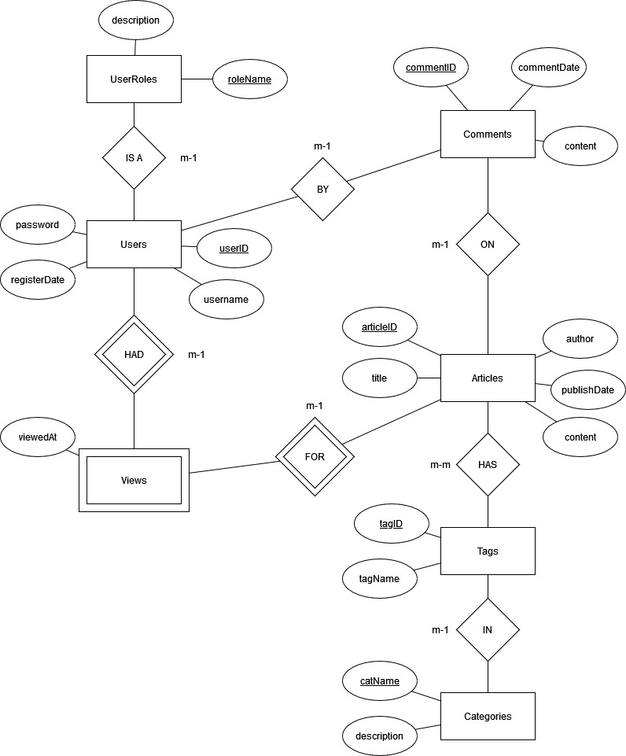

# CSCI 370 Project Report
Name: Ethan Posner (658-180-559)
Date: April 4, 2023
Course: CSCI 370

## Introduction

The goal of this project was to create an application and a supporting database to display news articles. It includes the ability for users to login and view articles. Users can interact with the application through a command-line interface. They can view recent articles, view articles by category, and view them based on tags. Each article shows what tags it has. Users also have the ability to comment on posts, and other users can see those comments. Users of this application includes anyone interested in keeping up with new knowledge, or in learning new things in general.

## Data Description
### Semantic Schema
To support all application functionality, the database stores the following data:

- User Roles: The roles that users can have. They are either "user" or "admin".
- Users: Login information, as well as a foreign key to the user role.
- Articles: Title, author, publish date, and content of the article.
- Comments: Who commented, what article the comment was made on, when the comment was made, and what the comment contains.
- Article tags: For example, articles talking about technological breakthroughs in nuclear fusion energy production might all be tagged “Nuclear Fusion Energy”.
- Article Categories: Originally, each article was going to have a category, and would additionally have tags. After much thought and discussion with the instructor, however, it was decided that articles would only have tags, and that these tags would have a foreign key to the category. This allows articles to have multiple categories and tags while avoiding the need for a separate many to many relationship between articles and categories.

### Schema
```
UserRoles(roleName, description)
Users(userID, username, password, registerDate, roleName)
Articles(articleID, title, author, publishDate, content)
Comments(commentID, articleID, userID, commentDate, content)
Categories(catName, description)
Tags(tagID, tagName, catName)
ArticleTags(articleID, tagID)
ArticleViews(articleID, userID, viewedAt)
```
- In Users, roleName references UserRoles
- In Comments, articleID references Articles and userID references Users
- In Tags, catName references Categories
- In ArticleTags, articleID references Articles and tagID references Tags
- In ArticleViews, articleID references Articles and userID references Users

## Application Requirements
Below are the major functionalities that were planned for this application.

### 1. User Login

Upon entering the application, users will be prompted to enter a username and password. They will be unable to access the application without logging in.

### 2. View articles by date

Upon logging into the application, users should be shown a list of articles. These articles should be displayed in order based on their publication dates, with newer ones being shown first. Articles in this list should display their title, author, publication date, category, tags, and the first few sentences of the actual article.

Users should also be able to select a specific article to view, and once selected, should be shown the entire article’s contents. If the article is large, they should be able to scroll down to see the rest of it.

### 3. View articles in specific categories

After logging in and having been shown the initial display of articles, users should be able to select a specific category of articles to view. Upon selecting a category, they should be shown a list of articles in that category. These should be ordered by their publication date with newer articles being shown first.

### 4. View articles with specific tags

Similarly to categories, users should be able to view all articles that have a specific tag. 

### 5. Comment on articles and see other user comments

After selecting an article, users should be able to make comments on them. They should also be able to view other user comments at the bottom of the article.

### 6. Admins can view reports for article viewing

A logged in admin user should be able to view reports for most viewed articles, most popular tags, most popular categories, most active users, etc for a given year. For example, they could generate a report called “most popular categories in the year 2022”. If there is time, they should also be able to view metrics for specific articles, categories, and tags. For example, a report of this type might read “most popular articles in the ‘Politics’ category in 2022”.

### Stretch Goals

### 1. User Registration

With the current development plan, users will require the database administrator to setup their accounts. If there is time, it would be more convenient for users to be able to create accounts themselves.

This might also include other complicated components, such as allowing users to reset their passwords with a recovery email. An initial implementation of this feature would be more simple, however.

### 2. Searching for Articles

An interesting and useful feature would be to allow users to search for specific articles by typing the name, or keywords, into a prompt. This could also include the ability to filter the search results further. For example, to search specifically for articles under the category of “Politics” with the tag “Canada” and make a search for “election results”.

## Database Design
This section will include the ER diagram and relational schema, and is a continuation of the data description section. Refer back to the data description section for a more detailed explanation of how the data is meant to be used in the application.

### ER Diagram


### Relational Schema
```sql
-- For this project, this will likely consist solely of "user" and "admin". 
-- The "admin" role will be able to view reports for what articles/tags/users/categories are most popular/active
-- The "user" role will be able to view articles (with various sorting options), and comment on them.
create table UserRoles (
    roleName varchar(255) primary key,
    description varchar(1500)
);

create table Users (
    userID integer primary key,
    username varchar(255),
    password varchar(512),
    registerDate date,
    roleName varchar(255) references UserRoles
);

-- e.g. "How to make a database", "How to make a database in MySQL", "How to make a database in MySQL using SQL"
create table Articles (
    articleID integer primary key,
    title varchar(255),
    author varchar(255),
    publishDate date,
    content clob
);

-- Comments on articles
-- e.g. "This is a great article", "I don't agree with you", "I like your article"
create table Comments (
    commentID integer primary key,
    articleID integer references Articles,
    userID integer references Users,
    commentDate date,
    content clob
);

-- Article categories
create table Categories (
    catName varchar(255) primary key,
    description varchar(1500)
);

-- Tags for articles
-- e.g. "database", "sql", "mysql"
create table Tags (
    tagID integer primary key,
    tagName varchar(255),
	catName varchar(255) references Categories
);

-- Many to many relationship to show which tags are associated with which articles
-- e.g. article "How to make a database" might have tags "database", "sql", "mysql
create table ArticleTags (
    articleID integer references Articles,
    tagID integer references Tags
);

-- Many to many relationship to show which users have viewed which articles,
-- and at what times
create table ArticleViews (
    articleID integer references Articles,
    userID integer references Users,
    viewedAt timestamp
);
```

## Implementation

This application was implemented using Python 3.9. This was chosen because it is a popular language that is easy to learn and use. In addition, I used a few very useful libraries that made the application easier to implement.

All major functionalities mentioned in the "Application Requirements" section were implemented. Due to time constraints, neither of the stretch goals were implemented. Allowing admins to create new users would have been a useful feature, and would be easy to implement in the future. The searching for articles feature would have been more difficult to implement, and would have required more time.

### Module Structure
- main.py: The main entry point for the application.
- db.py: Contains most of the database logic, including connecting to the database, and executing SQL queries.
- queries.py: Contains all of the SQL queries used in the application.
- generate_report.py: Logic for generating admin and user reports.
- article_view.py: Logic for displaying articles and comments.

### Technologies
- rich: Made it very easy to display text in tables, and to display text in a scrollable window.
- pytest: A highly useful Python testing framework. Must easier to use than the default "unitttest" library.
- oracledb: A Python library for connecting to Oracle databases.

### Challenges
#### Article Pager
One of the most difficult features to implement was the displaying of articles. Since a large article might not be properly displayed, and might be cut off if the user's monitor wasn't large enough. I initially wanted to redirect the console output to "less", but this proved to be more difficult than initially anticipated. I decided to use a pager from the "rich" Python library. This allowed me to display the article in a scrollable window, and allowed the user to scroll up and down to view the entire article. Using rich, this was easy to implement, and it works on most platforms.

#### Incrementing IDs
Due to time constraints, I chose to focus on implementing features and never took the time to implement a proper system for using triggers to increment IDs. Instead, I chose to use an SQL query to see the maximum ID, then manually increment it by one. This solution has a few problems. First, if two users on separate machines tried to create a comment at the same time, the database would register conflicts. In the future, triggers and sequences should be used whenever possible to ensure that IDs are unique.

## Testing

### Test Data
I used the following data for testing purposes:
```sql
insert into UserRoles (roleName) values ('user');
insert into UserRoles (roleName) values ('admin');

insert into Users values (0, 'bob', '123',
                          to_date('2022-01-01', 'YYYY-MM-DD'), 'user');

insert into Users values (1, 'rick', '123',
                          to_date('2022-01-02', 'YYYY-MM-DD'), 'admin');

insert into Users values (2, 'fred', '123',
                          to_date('2022-01-03', 'YYYY-MM-DD'), 'user');

insert into Categories values ('technology', 'Technological breakthroughs, new products, etc');
insert into Categories values ('politics', 'Leaders, elections, foreign policy, etc');
insert into Categories values ('cooking', 'All things cooking and food: recipes, ingredients, etc');

insert into Tags values (0, 'database', 'technology');
insert into Tags values (1, 'quantum computing', 'technology');
insert into Tags values (2, 'world leaders', 'politics');
insert into Tags values (3, 'elections', 'politics');
insert into Tags values (4, 'italian food', 'cooking');
insert into Tags values (5, 'greek food', 'cooking');


insert into Articles (articleID, title, author, publishDate, content)
                    values (0, 'How to make a database', 'Bill Jameson',
                            to_date('2022-01-01', 'YYYY-MM-DD'),
                            'First, you need to setup a database instance. Then create your tables. Finally, create an application that does something useful with it.');

insert into Articles values (1, 'President of Venezuela resigns', 'John Smith',
                            to_date('2022-01-03', 'YYYY-MM-DD'),
                            'President of Venezuela resigns after 10 years in office.');

insert into Articles values (2, 'Quantum computing breakthrough', 'John Smith',
                            to_date('2022-01-05', 'YYYY-MM-DD'),
                            'Quantum computing breakthrough allows for faster calculations.');


insert into ArticleTags values (0, 0);
insert into ArticleTags values (1, 2);
insert into ArticleTags values (2, 1);

insert into Comments values (0, 0, 0, to_date('2022-01-01', 'YYYY-MM-DD'), 'This is a great article');
insert into Comments values (1, 0, 1, to_date('2022-01-01', 'YYYY-MM-DD'), 'I don''t agree with you');
insert into Comments values (2, 0, 2, to_date('2022-01-01', 'YYYY-MM-DD'), 'I like your article');
insert into Comments values (3, 1, 0, to_date('2022-01-01', 'YYYY-MM-DD'), 'This is a great article');
insert into Comments values (4, 2, 1, to_date('2022-01-01', 'YYYY-MM-DD'), 'You dont understand quantum mechanics');
insert into Comments values (5, 1, 2, to_date('2022-01-01', 'YYYY-MM-DD'), 'This could be disastrous for the country');

insert into ArticleViews values (0, 0, to_timestamp('2022-01-01 12:00:00', 'YYYY-MM-DD HH24:MI:SS'));
insert into ArticleViews values (0, 0, to_timestamp('2022-01-01 12:00:00', 'YYYY-MM-DD HH24:MI:SS'));
insert into ArticleViews values (0, 2, to_timestamp('2022-01-01 12:00:00', 'YYYY-MM-DD HH24:MI:SS'));
insert into ArticleViews values (2, 2, to_timestamp('2022-01-01 12:00:00', 'YYYY-MM-DD HH24:MI:SS'));
insert into ArticleViews values (2, 1, to_timestamp('2022-01-01 12:00:00', 'YYYY-MM-DD HH24:MI:SS'));
insert into ArticleViews values (2, 2, to_timestamp('2022-01-01 12:00:00', 'YYYY-MM-DD HH24:MI:SS'));
insert into ArticleViews values (1, 2, to_timestamp('2022-01-01 12:00:00', 'YYYY-MM-DD HH24:MI:SS'));
```

### Unit Tests
Please find all unit tests in the `tests` directory. All unit tests were written using the pytest framework. To run the unit tests, run `make test`. Running tests will remove all database content and continually restore it, so ensure that you reinitialize the database content before using the application again.

Due to time constraints, not all functionality is fully tested. More tests should be written in the future to ensure that all functionality is fully functional, and to make future development go more smoothly.

#### test_db.py
Tests the `db.py` file. Ensures that all of the correct data is returned from the database based on the test data. This was the easiest file to test. In the future, anything that uses SQL queries should be put into the `db.py` file, and tests should be written for all of them.

#### test_main.py
Integration tests to ensure that no errors occur when high-level operations are performed by the user. Right now, only successfully logging in is tested. In the future, additional tests should be added for viewing articles, commenting on articles, admin logins, etc.

Mocking user input was quite difficult to accomplish. I used this following resources:
- [Github - Monkeypatching user input with pytest (GenevieveBuckley)](https://gist.github.com/GenevieveBuckley/efd16862de9e2fe7adfd2bf2bef93e02)
- [Stackoverflow - How to test a function with input call? (mareoraft)](https://stackoverflow.com/a/36377194/6946463)

### Scenarios
#### User Login and View Articles
1. Run the application: `make run`
2. Login as "bob" with password "123"
3. Enter "d" to view articles by date.
4. Enter "v" to view a specific article. Enter 1 to view the article with ID "1".
5. Enter "z" to view the comments on the article.
6. Enter "g" to list all tags.
7. Enter "t" to view articles with a given tag. Enter "0" to view articles with tag "database".
8. Enter "a" to view all categories.
9. Enter "c" to view articles with a given category. Enter "technology" to view articles in that category.
10. Logout and quit the application.

#### User login and comment on article
1. Run the application: `make run`
2. Login as "bob" with password "123"
3. Enter "d" to view articles by date.
4. Enter "v" to view a specific article. Enter 1 to view the article with ID "1".
5. Enter "x" to comment on the article. Enter "This is a comment" to comment on the article.
6. Enter "z" to view the comments on the article. You should see the comment you just made.
7. Logout and quit the application.

#### Admin Login and View Reports
1. Run the application: `python3 src/main.py`
2. Login as "rick" with password "123"
3. Enter "r1" to view report of views and number of comments for each article. Enter 2022 for the year.
5. Enter "r2" to view report of number of articles and number of views for each tag. Enter 2022 for the year.
4. Enter "r3" to view report of number of articles by category. Enter 2022 for the year.
6. Enter "r4" to view report of views and number of comments for each user. Enter 2022 for the year.
7. Logout and quit the application.

## Conclusion and Future Work
Working on this project taught me a great deal about database development. It taught me that it's especially important to have a solid database design before starting development in order to ensure that the database is easy to use and maintain. It also taught me that pushing more work onto the DBMS can drastically reduce the complexity of the application. For example, if I had manually implemented the admin reports, they would have been incredibly inefficient, would be incredibly complex, and would have taken a long time. Using SQL queries, however, I was able to drastically reduce how much code I had to write.

If development of this project was to continue into the future, it is unclear what could be done with it. Perhaps the database functionality could be integrated into a website? I would like to continue development of this project and add many new features to it. The two stretch goals would be the main features I would work on. I would also like to add more unit tests to ensure better code quality.
